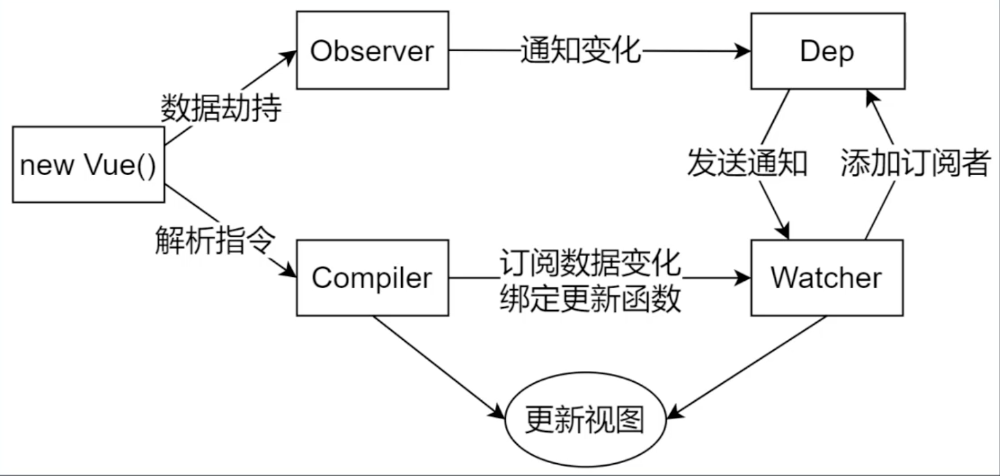

# Vue响应式原理模拟

## 一、数据驱动
数据响应式  
数据模型仅仅是普通的 JavaScript 对象，而当我们修改数据时，视图会进行更新，避免了繁琐的 DOM 操作，提高开发效率

双向绑定
数据改变，视图改变；视图改变，数据也随之改变  
我们可以使用 v-model在表单元素上创建双向数据绑定

数据驱动  
是 Vue 最独特的特性之一  
开发过程中仅需要关注数据本身，不需要关心数据是如何渲染到视图

## 二、响应式的核心原理
Vue 2.x -> Object.defineProperty()  
数据劫持：遍历 data 对象的所有属性，把 data 中的属性，转换成 vm 的 getter/setter  
```
// 模拟 Vue 中的 data 选项
let data = {
  msg: 'hello',
  count: 10
}

// 模拟 Vue 的实例
let vm = {}

proxyData(data)

function proxyData(data) {
  // 遍历 data 对象的所有属性
  Object.keys(data).forEach(key => {
    // 把 data 中的属性，转换成 vm 的 setter/setter
    Object.defineProperty(vm, key, {
      enumerable: true,
      configurable: true,
      get () {
        console.log('get: ', key, data[key])
        return data[key]
      },
      set (newValue) {
        console.log('set: ', key, newValue)
        if (newValue === data[key]) {
          return
        }
        data[key] = newValue
        // 数据更改，更新 DOM 的值
        document.querySelector('#app').textContent = data[key]
      }
    })
  })
}

// 测试
vm.msg = 'Hello World'
console.log(vm.msg)
```

Vue 3.x -> Proxy  
直接监听对象，而非属性。ES6 中新增，IE不支持  
```
// 模拟 Vue 中的 data 选项
let data = {
  msg: 'hello',
  count: 0
}

// 模拟 Vue 实例
let vm = new Proxy(data, {
  // 执行代理行为的函数
  // 当访问 vm 的成员会执行
  get (target, key) {
    console.log('get, key: ', key, target[key])
    return target[key]
  },
  // 当设置 vm 的成员会执行
  set (target, key, newValue) {
    console.log('set, key: ', key, newValue)
    if (target[key] === newValue) {
      return
    }
    target[key] = newValue
    document.querySelector('#app').textContent = target[key]
  }
})

// 测试
vm.msg = 'Hello World'
console.log(vm.msg)
```


## 三、发布订阅模式和观察者模式
发布/订阅模式  
* 订阅者
* 发布者
* 信号中心

```
// 事件触发器
class EventEmitter {
  constructor () {
    this.subs = Object.create(null)
  }

  // 注册事件
  $on (eventType, handler) {
    this.subs[eventType] = this.subs[eventType] || []
    this.subs[eventType].push(handler)
  }

  // 触发事件
  $emit () {
    if (this.subs[eventType]) {
      this.subs[eventType].forEach(handler = {
        handler()
      })
    }
  }
}

// 测试
let em = new EventEmitter()
em.$on('click', () => {
  console.log('click1')
})
em.$on('click', () => {
  console.log('click2')
})

em.$emit('click')
```

观察者模式  
* 观察者（订阅者）-- Watcher  
  update()：当事件发生时，具体要做的事情
* 目标（发布者）-- Dep  
  subs数组：存储所有的观察者  
  addSub()：添加观察者  
  notify()：当事件发生，调用所有观察者的 update() 方法
* 没有事件中心

```
// 发布者-目标
class Dep {
  constructor () {
    // 记录所有的订阅者
    this.subs = []
  }
  // 添加订阅者
  addSub (sub) {
    if (sub && sub.update) {
      this.subs.push(sub)
    }
  }
  // 发布通知
  notify () {
    this.subs.forEach(sub => {
      sub.update()
    })
  }
}

// 订阅者-观察者
class Watcher {
  update () {
    console.log('update')
  }
}

// 测试
let dep = new Dep()
let watcher = new Watcher()

dep.addSub(watcher)

dep.notify()

```

总结  
**观察者模式**是由具体目标调度，比如当事件触发，Dep 就会去调用观察者的方法，所以观察者模
式的订阅者与发布者之间是存在依赖的。
**发布/订阅模式**由统一调度中心调用，因此发布者和订阅者不需要知道对方的存在。

## 四、Vue 响应式原理模拟
Vue  
* 负责接收初始化的参数  
* 负责把 data 中的属性注入到 Vue 实例，转换成 getter/setter  
* 负责调用 Observer 监听 data 中所有属性的变化  
* 负责调用 Compiler 解析指令/差值表达式

Observer  
数据劫持：能够对数据对象的所有属性进行监听，如有变动可拿到最新值并通知 Dep  
* 负责把 data 选项中的属性转换成响应式数据  
* data 中的某个属性也是对象，把该属性转换成响应式数据  
* 数据变化发送通知

Compiler  
解析指令：解析每个元素中的指令/插值表达式，并替换成相应的数据  
* 负责编译模板，解析指令/差值表达式  
* 负责页面的首次渲染  
* 当数据变化后重新渲染视图

Dep  
发布者：添加观察者(Watcher)，当数据变化通知所有观察者  
getter 收集依赖  
setter 通知依赖

Watcher  
观察者：数据变化更新视图  
* 当数据变化触发依赖，dep 通知所有的 Watcher 实例更新视图  
* 自身实例化的时候往 dep 对象中添加自己

调试  
1. 调试页面首次渲染的过程  
2. 调试数据改变更新视图的过程

总结  
给属性重新赋值成对象，是响应式的  
给Vue实例新增一个成员，不是响应式的

