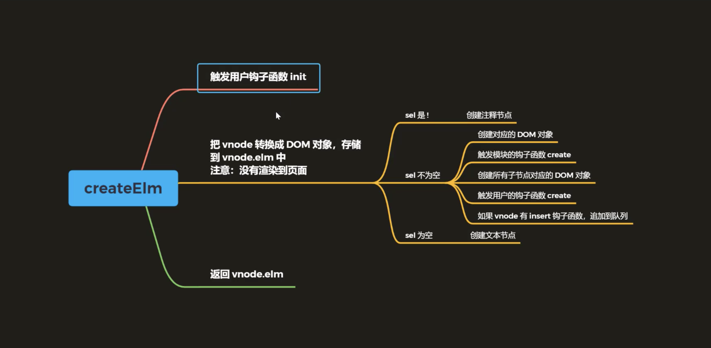
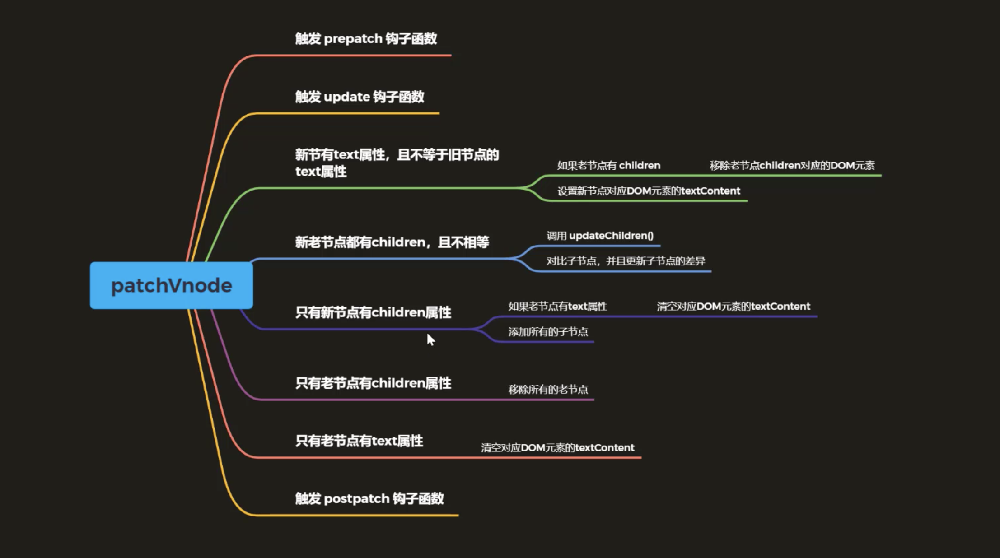

# 虚拟DOM

## 一、什么是 Virtual DOM（虚拟 DOM）
Virtual DOM，是由普通的 JS 对象来描述 DOM 对象，因为不是真实的 DOM 对象，所以叫 Virtual DOM

## 二、为什么使用 Virtual DOM
手动操作 DOM 比较麻烦，还需要考虑浏览器兼容性问题，虽然有 jQuery 等库简化 DOM 操作，
但是随着项目的复杂 DOM 操作复杂提升

为了简化 DOM 的复杂操作于是出现了各种 MVVM 框架，MVVM 框架解决了视图和状态的同步问
题

为了简化视图的操作我们可以使用模板引擎，但是模板引擎没有解决跟踪状态变化的问题，于是
Virtual DOM 出现了

Virtual DOM 的好处是当状态改变时不需要立即更新 DOM，只需要创建一个虚拟树来描述
DOM， Virtual DOM 内部将弄清楚如何有效(diff)的更新 DOM

参考 github 上 virtual-dom 的描述  
* 虚拟 DOM 可以维护程序的状态，跟踪上一次的状态  
* 通过比较前后两次状态的差异更新真实 DOM

## 三、虚拟 DOM 的作用
* 维护视图和状态的关系  
* 复杂视图情况下提升渲染性能  
* 除了渲染 DOM 以外，还可以实现 SSR（Nuxt.js/Next.js）、原生应用（Weex/React Native）、小程序（mpvue/uni-app）等

## 四、Virtual DOM 库
* Snabbdom  
* virtual-dom

## 五、Snabbdom 基本使用
yarn add snabbdom  
```
import { init, h, thunk } from 'snabbdom'

// init() 的 参数是数组，将来可以传入模块，处理属性/样式/事件等
// 返回值：patch函数，作用对比两个vnode的差异更新到真实DOM
let patch = init([])

// 使用 h() 函数创建 vnode
// 第一个参数：标签+选择器
// 第二个参数：如果是字符串的话就是标签中的内容，如果是数组就是子元素
let vnode = h('div.cls', [
  h('h1', 'hello snabbdom'),
  h('p', '这是段落')
])

const app = document.querySelector('#app')

// 把vnode 渲染到空的 DOM 元素（替换）
// 会返回新的 vnode
// 第一个参数：可以是DOM元素，内部会把DOM元素转换成VNode
// 第二个参数：VNode
let oldVnode = patch(app, vnode)

// 更新
setTimeout(() => {
  vnode = h('div#container', [
    h('h1', 'Hello World'),
    h('p', 'Hello P')
  ])
  patch(oldVnode, vnode)

  // 清空页面元素 -- 错误
  // patch(oldVnode, null)
  patch(oldVnode, h('!'))
}, 2000)
```
Snabbdom 的核心仅提供最基本的功能，只导出了三个函数init()、h()、thunk()  
* init() 是一个高阶函数，返回 patch()  
* h() 返回虚拟节点 VNode  
* thunk() 是一种优化策略，可以在处理不可变数据时使用

## 六、Snabbdom 模块
Snabbdom 的核心库并不能处理元素的属性/样式/事件等，如果需要处理的话，可以使用模块  

常用模块  
attributes、props、class、dataset、eventlisteners、style

模块使用  
* 导入需要的模块
* init() 中注册模块
* 使用 h() 函数创建 VNode 的时候，可以把第二个参数设置为对象，其他参数往后移

```
import { init, h } from 'snabbdom'
// 1. 导入模块
import style from 'snabbdom/modules/style'
import eventlisteners from 'snabbdom/modules/eventlisteners'
// 2. 注册模块
let patch = init([
  style,
  eventlisteners
])
// 3. 使用 h() 函数的第二个参数传入模块需要的数据（对象）
let vnode = h('div', {
  style: {
    backgroundColor: 'red'
  },
  on: {
    click: eventHandler
  }
}, [
  h('h1', 'Hello Snabbdom'),
  h('p', '这是p标签')
])

function eventHandler () {
  console.log('点击我了')
}

let app = document.querySelector('#app')

let oldVnode = patch(app, vnode)


vnode = h('div', 'hello')
patch(oldVnode, vnode)
```

## 七、Snabbdom 源码解析
Snabbdom 的核心  
* 使用 h() 函数创建 JavaScript 对象(VNode)描述真实 DOM  
* init() 设置模块，创建 patch()  
* patch() 比较新旧两个 VNode  
* 把变化的内容更新到真实 DOM 树上

**h()**  
核心就是调用 vnode 函数返回一个虚拟节点

**vnode**  
参数
```
sel // 选择器
data // 节点数据，属性、样式、事件等
children // 子节点，和text互斥
elm // 记录vnode对应的真实DOM
text // 节点中的内容，和children互斥
key // 优化用
```

**init**  
内部返回patch函数，把vnode渲染成真实dom，并返回vnode

**patch**  
patch(oldVnode, newVnode)
打补丁，把新节点中变化的内容渲染到真实 DOM，最后返回新节点作为下一次处理的旧节点  
* 对比新旧 VNode 是否是相同节点（节点的 key 和 sel 相同）  
* 如果不是相同节点，删除之前的内容，重新渲染  
* 如果是相同节点，再判断新的 VNode 是否有 text，如果有并且和 oldVnode 的 text 不同，直接更新文本内容  
* 如果新的 VNode 有 children，判断子节点是否有变化，判断子节点的过程使用的就是 diff 算法  
* diff 过程只进行同层级比较

**createElm**  
触发 init/create 钩子函数，创建 vnode 对应的 DOM 元素



**addVnodes 和 removeVnodes**  

**patchVnode**  
如果新旧节点是相同节点，在 patch 里面调用  
对比 oldVnode 和 vnode 的差异，把差异渲染到 DOM



**updateChildren**  
diff 算法的核心，对比新旧节点的 children，更新 DOM  
只需要找同级别的子节点依次比较，然后再找下一级别的节点比较  

执行过程  
* 在进行同级别节点比较的时候，首先会对新老节点数组的开始和结尾节点设置标记索引，遍历的过程中移动索引  
* 在对开始和结束节点比较的时候，总共有四种情况  
    * oldStartVnode/newStartVnode (旧开始节点/新开始节点)  
    * oldEndVnode/newEndVnode (旧结束节点/新结束节点)  
    * oldStartVnode/newEndVnode (旧开始节点/新结束节点)  
    * oldEndVnode/newStartVnode (旧结束节点/新开始节点)  
* 开始节点和结束节点比较，这两种情况类似  
    * oldStartVnode/newStartVnode (旧开始节点/新开始节点)  
    * oldEndVnode/newEndVnode (旧结束节点/新结束节点)  
* 如果 oldStartVnode 和 newStartVnode 是 sameVnode（key 和 sel 相同）  
    * 调用 patchVnode() 对比和更新节点  
    * 把旧开始和新开始索引往后移动 oldStartIdx++ / oldEndIdx++  
* oldStartVnode/newEndVnode (旧开始节点/新结束节点) 相同  
    * 调用 patchVnode() 对比和更新节点  
    * 把 oldStartVnode 对应的 DOM 元素，移动到右边  
    * 更新索引  
* oldEndVnode/newStartVnode (旧结束节点/新开始节点) 相同
    * 调用 patchVnode() 对比和更新节点  
    * 把 oldEndVnode 对应的 DOM 元素，移动到左边  
    * 更新索引  
* 如果不是以上四种情况  
    * 遍历新节点，使用 newStartVnode 的 key 在老节点数组中找相同节点  
    * 如果没有找到，说明 newStartVnode 是新节点  
        * 创建新节点对应的 DOM 元素，插入到 DOM 树种  
    * 如果找到了  
        * 判断新节点和找到的老节点的 sel 选择器是否相同  
        * 如果不相同，说明节点被修改了  
            * 重新创建对应的 DOM 元素，插入到 DOM 树中  
        * 如果相同，把 elmToMove 对应的 DOM 元素，移动到左边  
* 循环结束  
    * 当老节点的所有子节点先遍历完（oldStartIdx > oldEndIdx），循环结束  
    * 当新节点的所有子节点先遍历完（newStartIdx > newEndIdx），循环结束  
* 如果老节点的数组先遍历完（oldStartIdx > oldEndIdx），说明新节点有剩余，把剩余节点批量插入到右边  
* 如果新节点的数组先遍历（newStartIdx > newEndIdx），说明老节点有剩余，把剩余节点批量删除


## 八、Modules 源码
patch() -> patchVnode() -> updateChildren()  
snabbdom 为了保证核心库的精简，把处理元素的属性/事件/样式等工作，放置到模块中  
模块可以按照需要引入  
模块实现的核心是基于 Hooks

