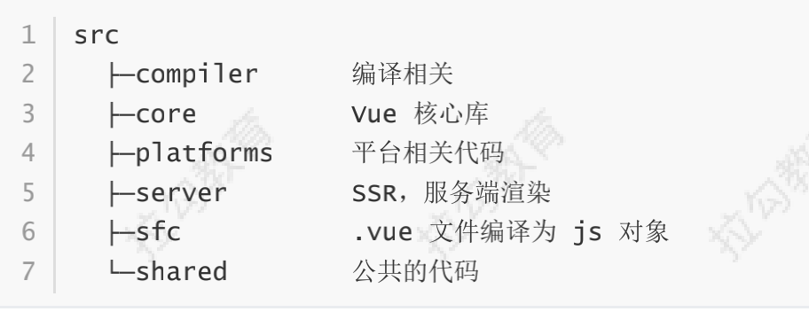

# 响应式原理

## 一、Vue.js 的静态成员和实例成员初始化过程
### 准备工作
1. Vue 源码的获取  
项目地址：https://github.com/vuejs/vue

2. 源码目录结构  

3. 了解 Flow  
官网：https://flow.org/  
JavaScript 的静态类型检查器  
Flow 的静态类型检查错误是通过静态类型推断实现的

4. 打包  
打包工具 Rollup  
安装依赖  
设置 sourcemap  
执行 dev

5. 调试  
examples 的示例中引入的 vue.min.js 改为 vue.js  
打开 Chrome 的调试工具中的 source

### Vue 的不同构建版本
完整版：同时包含编译器和运行时的版本  
编译器：用来将模板字符串编译成为 JavaScript 渲染函数的代码，体积大、效率低  
运行时：用来创建 Vue 实例、渲染并处理虚拟 DOM 等的体积，体积小、效率高。基本上就是除去编译器的代码  
UMD：UMD 版本通用的模块版本，支持多种模块方式。 vue.js 默认文件就是运行时 + 编译器的
UMD 版本  
CommonJS(cjs)：CommonJS 版本用来配合老的打包工具比如 Browserify 或 webpack 1  
ES Module：从 2.6 开始 Vue 会提供两个 ES Modules (ESM) 构建文件，为现代打包工具提供的
版本

### 入口文件
src/platform/web/entry-runtime-with-compiler.js  
阅读源码记录  
* el 不能是 body 或者 html 标签
* 如果没有 render，把 template 转换成 render 函数
* 如果有 render 方法，直接调用 mount 挂载 DOM

### 初始化过程
四个导出 Vue 的模块  
* src/platforms/web/entry-runtime-with-compiler.js  
    * web 平台相关的入口  
    * 重写了平台相关的 $mount() 方法  
    * 注册了 Vue.compile() 方法，传递一个 HTML 字符串返回 render 函数  
* src/platforms/web/runtime/index.js  
    * web 平台相关  
    * 注册和平台相关的全局指令：v-model、v-show  
    * 注册和平台相关的全局组件： v-transition、v-transition-group  
    * 全局方法：  
        * __patch__：把虚拟 DOM 转换成真实 DOM  
        * $mount：挂载方法  
* src/core/index.js  
    * 与平台无关  
    * 设置了 Vue 的静态方法，initGlobalAPI(Vue)  
* src/core/instance/index.js  
    * 与平台无关  
    * 定义了构造函数，调用了 this._init(options) 方法  
    * 给 Vue 中混入了常用的实例成员  

静态成员  
src/core/global-api/index.js

实例成员  
src/core/instance/index.js

## 二、首次渲染的过程

## 三、数据响应式原理

